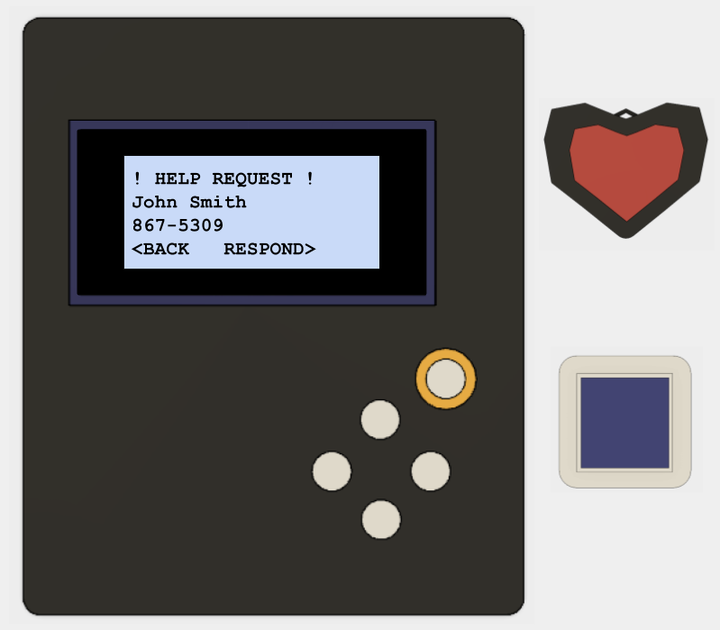

# HA-HA Button needs your help now!

| | |
|--|--|
|There are several medical alert systems for senior citizens on the market, however, these require up-front costs as well as monthly subscriptions. The fundamental idea behind our project is to provide an affordable means of protecting the health, welfare, and safety of elderly people through an active ad-hoc wireless network (estimated to have a working range of 300 feet) connected to personal push-button sensors, developed specifically for residents of the De Anza Santa Cruz Mobile Home Park. The final design should take into consideration the environmental conditions of the location (interference, transmission range), availability of parts, reproducibility by a third party in large scale, and affordability with a form factor satisfactory to the end user.||
|text text text||
|text text text||
